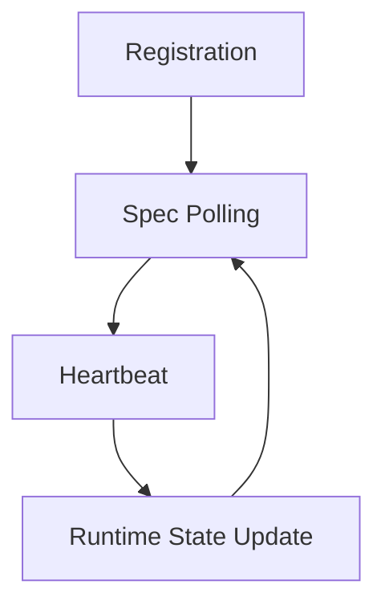

This document describes the **lifecycle of an engine instance** in the control-plane.

It outlines the main stages an instance goes through, from registration to regular operation,
and shows how the control-plane and the engine instance interact during that process.

# Instance Lifecycle

Together these mechanisms provide a
**simple and safe control‑plane coordination protocol**.

# Lifecycle Stages

The lifecycle consists of several stages. Each stage represents a part of the
interaction between the engine instance and the control-plane.

Detailed documentation for each stage is provided in separate documents:

- [Registration](registration.md)
- [Spec Polling](TODO)
- [Heartbeat](TODO)
- [Runtime State Update](TODO)

## Registration

[Registration](../docs/registration.md) is the process of an engine instance
announcing itself to the control-plane and receiving its assigned epoch.
