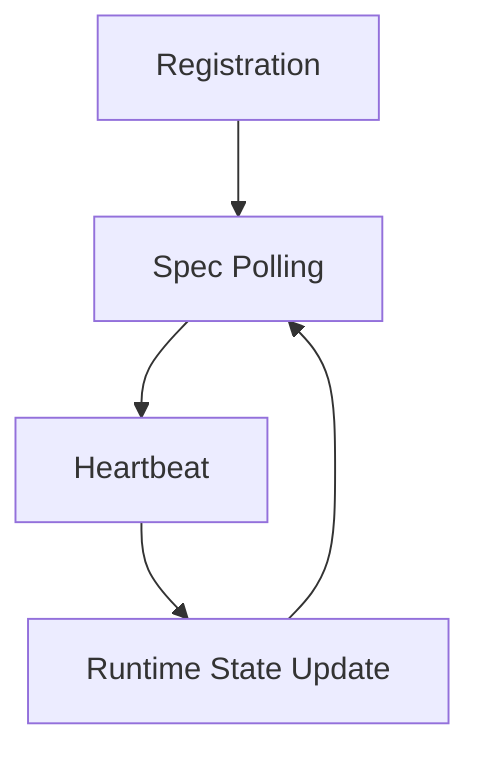

This document describes the **lifecycle of an engine instance** in the control-plane.

It outlines the main stages an instance goes through, from registration to regular operation,
and shows how the control-plane and the engine instance interact during that process.

# Instance Lifecycle

Together these mechanisms provide a
**simple and safe control‑plane coordination protocol**.

# Lifecycle Stages

The lifecycle consists of several stages. Each stage represents a part of the
interaction between the engine instance and the control-plane.

Detailed documentation for each stage is provided in separate documents:

- [Registration](registration.md)
- [Spec Polling](spec-polling.md)
- [Heartbeat](heartbeat.md)
- [Runtime State Update](TODO)

## Registration

[Registration](registration.md) is the process of an engine instance
announcing itself to the control-plane and receiving its assigned epoch.

It establishes runtime ownership and initializes the runtime snapshot:

- assigns a new monotonic `epoch`
- records the instance in history
- makes the instance the current runtime owner

## Heartbeat

[Heartbeat](heartbeat.md) is the periodic signal sent by the current engine
instance after registration.

It keeps the runtime snapshot fresh and confirms that the current owner is
still alive:

- validates `instance_id` and `epoch`
- ignores duplicate, old, or stale-owner heartbeats
- updates `reported_phase`, `observed_generation`, `last_seen_at`, and `last_seq_no`
